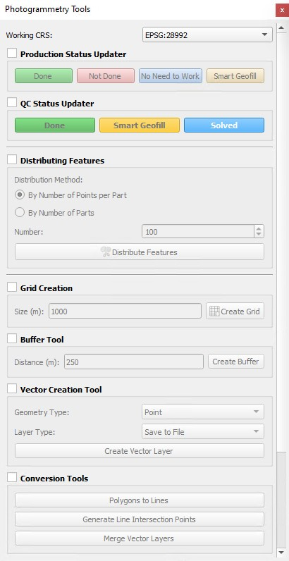
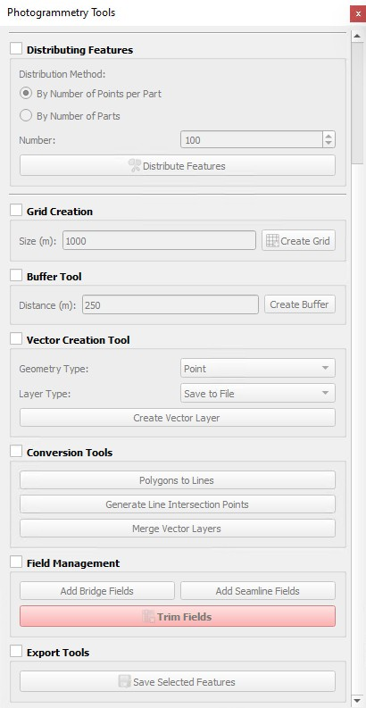

# QGIS Photogrammetry Tools Plugin

A comprehensive QGIS plugin designed for photogrammetry workflows, providing essential tools for production management, spatial analysis, and quality control processes.


<br>
<div align="center">
  
  
</div>

## Overview

This plugin streamlines photogrammetry workflows by providing a comprehensive toolset in a convenient dock widget. It handles coordinate reference systems automatically, ensures precise measurements, and includes specialized tools for production status tracking and quality control.

## Key Features

## 🚀 Features

### 🎯 Feature Distribution Tool (NEW)
- **Intelligent Clustering**: Distribute features into manageable parts using K-means clustering
- **Flexible Distribution**: Choose between distributing by number of points per part or total number of parts
- **Preview & Confirm**: Review distribution before saving
- **Automatic Part Numbering**: Each part gets a unique identifier
- **Multi-format Support**: Works with both point and polygon layers

### 🏗️ Production Management
- **Status Tracking**: Mark features as Done, Not Done, No Need to Work, or Smart Geofill
- **QC Workflow**: Comprehensive quality control status management
- **Rework Tracking**: New field for tracking rework requirements
- **Batch Updates**: Update status for multiple selected features at once

### 🗂️ Field Management
- **Bridge Fields**: Add standard production tracking fields (Part, Assign, Status, Remarks, QC, QCRemarks, Rework)
- **Seamline Fields**: Add specialized fields for seamline workflows (includes geometry-specific fields)
- **Field Trimming**: Remove non-standard fields while preserving essential ones
- **Smart Detection**: Automatically detects existing fields to avoid duplicates

### 🔧 Geospatial Tools
- **Grid Creation**: Generate precise measurement grids with customizable spacing
- **Buffer Tool**: Create smooth buffers with enhanced edge quality (50 segments)
- **Vector Creation**: Create both temporary scratch layers and permanent file-based layers
- **Layer Conversion**: Convert polygons to lines, generate intersection points
- **Layer Merging**: Merge multiple vector layers with geometry type filtering

### 📍 CRS Management
- **Global CRS Selector**: Set working coordinate reference system for all operations
- **Validation**: Ensures CRS uses meters for accurate measurements
- **Auto-reprojection**: Automatically handles CRS transformations when needed
- **Supported CRS**: Pre-configured with common projected coordinate systems

### 🎨 User Interface
- **Collapsible Tool Groups**: Organized interface with checkable group boxes
- **Global CRS Selector**: Centralized coordinate system management
- **Color-coded Buttons**: Visual status indicators for production workflow
- **Scrollable Interface**: Compact design that fits in QGIS dock areas
- 
## 📋 Requirements

- **QGIS**: Version 3.0 or higher
- **Python Libraries** (for distribution tool):
  - `scikit-learn`: For K-means clustering
  - `numpy`: For numerical operations

## Supported Coordinate Systems

The plugin is optimized for metric coordinate reference systems:

- **EPSG:28992** - RD New (Netherlands)
- **EPSG:31370** - Belgian Lambert 72 (Belgium)
- **EPSG:2154** - RGF93 / Lambert-93 (France)
- **EPSG:32631** - WGS 84 / UTM zone 31N

## Installation

### Method 1: Manual Installation
1. Download the latest plugin Zip file. 
2. Go to Plugins> Manage and Install Plugins...> Install from ZIP> Browse the downloaded file 
Or
1. Download and Extract the ZIP
2. Copy to your QGIS plugins directory:
   - **Windows**: `C:\Users\[username]\AppData\Roaming\QGIS\QGIS3\profiles\default\python\plugins\photogrammetry_tools\`
   - **macOS**: `~/Library/Application Support/QGIS/QGIS3/profiles/default/python/plugins/photogrammetry_tools/`
   - **Linux**: `~/.local/share/QGIS/QGIS3/profiles/default/python/plugins/photogrammetry_tools/`
3. For using the Distribution Tool you need to install scikit-learn numpy
4. Open start menu, search and open "OSGeo4W Shell"
5. Type "pip install scikit-learn numpy"
6. Restart QGIS
7. Enable the plugin: **Plugins → Manage and Install Plugins → Installed → Photogrammetry Tools**

### Method 2: Development Setup
```bash
# Clone the repository
git clone https://github.com/rivantesifat/qgis-photogrammetry-tools.git

# Create symbolic link to QGIS plugins directory
# Linux/macOS:
ln -s /path/to/qgis-photogrammetry-tools ~/.local/share/QGIS/QGIS3/profiles/default/python/plugins/photogrammetry_tools

# Windows (run as administrator):
mklink /D "C:\Users\[username]\AppData\Roaming\QGIS\QGIS3\profiles\default\python\plugins\photogrammetry_tools" "C:\path\to\qgis-photogrammetry-tools"
```

## Quick Start Guide

### 1. Setup Your Workspace
1. Open the plugin dock: **Plugins → Photogrammetry Tools** the plugin dock will appear on the right side of QGIS.
2. Select your working CRS from the dropdown
3. Enable the tool groups you need by checking the group boxes

### 2.Feature Distribution Workflow
1. **Select Layer**: Choose a point or polygon layer
2. **Choose Method**: 
   - "By Number of Points per Part": Specify how many features per part
   - "By Number of Parts": Specify total number of parts to create
3. **Set Number**: Enter the desired number value
4. **Distribute**: Click "Distribute Features"
5. **Review**: Check the distribution summary in the dialog
6. **Save**: Confirm to save parts as separate shapefiles

### 2. Production Status Management
```
Select features → Choose status button → Features updated automatically
```
- **Green "Done"**: Mark completed features
- **Red "Not Done"**: Mark pending features  
- **Blue "No Need to Work"**: Mark features requiring no work
- **Orange "Smart Geofill"**: Mark features for automated processing

### 3. Create Precision Grids
1. Select a reference layer to define the grid extent
2. Enter grid size in meters (e.g., 1000 for 1km × 1km cells)
3. Click "Create Grid"
4. Grid is automatically aligned and saved as shapefile

### 4. Generate Smooth Buffers
1. Select a polygon layer
2. Enter buffer distance in meters (e.g., 250)
3. Click "Create Buffer"
4. Buffer created with 50 segments for smooth curves

## Field Standards

### Bridge Fields (Add Bridge Fields button)
| Field | Type | Description |
|-------|------|-------------|
| Part | Integer | Part number identifier |
| Assign | String | Assignment information |
| Status | String | Production status |
| Remarks | String | Production remarks |
| QC | String | Quality control status |
| QCRemarks | String | QC remarks |
| Rework | String | Rework requirements |

### Seamline Fields (Add Seamline Fields button)
Includes all Bridge fields plus:
| Field | Type | Description |
|-------|------|-------------|
| Geo_Assign | String | Geometry assignment |
| Geo_Stat | String | Geometry status |
| Geo_QC | String | Geometry QC status |

## Technical Requirements

### Dependencies
- **QGIS**: 3.0 or higher
- **PyQt**: 5.x (included with QGIS)
- **QGIS Processing**: Framework (included with QGIS)

### Hardware Requirements
- **Memory**: 4GB RAM minimum, 8GB recommended
- **Storage**: 50MB for plugin installation
- **Display**: 1024x768 minimum resolution

## 🎨 Interface Overview

### Tool Groups
- **Production Status Updater**: Quick status updates with color-coded buttons
- **QC Status Updater**: Quality control workflow management
- **Distributing Features**: Intelligent feature distribution tool
- **Grid Creation**: Precise grid generation
- **Buffer Tool**: Enhanced buffering with smooth edges
- **Vector Creation Tool**: Layer creation utilities
- **Conversion Tools**: Format conversion and processing
- **Field Management**: Schema management for workflows
- **Export Tools**: Data export utilities

### Color Coding
- 🟢 **Green**: Done/Completed status
- 🔴 **Red**: Not Done/Pending status
- 🔵 **Blue**: No Need to Work/Special status
- 🟡 **Yellow**: Smart Geofill/Automated status

## 📊 Technical Details

### Feature Distribution Algorithm
- **Clustering Method**: K-means clustering with scikit-learn
- **Coordinate Extraction**: 
  - Points: Direct coordinates
  - Polygons: Centroid coordinates
- **Random Seed**: Fixed (42) for reproducible results
- **Memory Efficient**: Processes large datasets without loading all features into memory

### CRS Support
- **Primary CRS Options**:
  - EPSG:28992 (Dutch National Grid)
  - EPSG:31370 (Belgian Lambert 72)
  - EPSG:2154 (French Lambert-93)
  - EPSG:32631 (UTM Zone 31N)
- **Unit Validation**: Ensures selected CRS uses meters
- **Auto-transformation**: Handles reprojection automatically

## Advanced Features

### CRS Handling
- Automatic validation ensures selected CRS uses meters
- Automatic reprojection when layers use different CRS
- Project CRS automatically updated for consistent measurements
- Transform context handling for accurate coordinate transformations

### Processing Algorithms
- **Grid Creation**: Uses `native:creategrid` with precise alignment
- **Buffer Creation**: Uses `native:buffer` with 50 segments and round joins
- **Line Intersections**: Uses `native:lineintersections` for point generation
- **Polygon to Lines**: Uses `native:polygonstolines` for conversion
- **Merge Vector Layers**: Uses `native:mergevectorlayers` for Merging

### Error Handling
- Input validation for numeric fields
- CRS compatibility checking
- Layer type validation
- Feature selection verification
- File path validation for exports

## Troubleshooting

### Common Issues

**Distribution tool not working**
- Install required Python libraries: `pip install scikit-learn numpy`
- Ensure layer has at least 2 features
- Check that geometry is not empty
- 
**Grid not aligned properly**
- Ensure reference layer has features
- Check that grid size is appropriate for layer extent
- Verify CRS uses meters as units

**CRS warnings**
- Select a CRS that uses meters as units
- Ensure your data is in a suitable projected coordinate system

**Buffer appears jagged**
- Plugin creates buffers with 50 segments for smooth curves
- Older QGIS versions may have different defaults
- Check that input layer is valid polygon geometry

**Fields not added**
- Layer must be editable
- Check that field names don't already exist
- Ensure layer is a vector layer, not raster

**Status updates not working**
- Select features before clicking status buttons
- Ensure required fields exist (use Add Bridge/Seamline Fields first)
- Check that layer is in edit mode

**Memory issues with large datasets**
- Close unnecessary applications
- Process data in smaller chunks
- Use temporary layers for intermediate results

### Performance Tips
- Use projected coordinate systems for better performance
- Close unnecessary layers while processing
- Save work frequently when batch processing

## Contributing

We welcome contributions! Here's how to help:

1. **Fork** the repository
2. **Create** a feature branch (`git checkout -b feature/amazing-feature`)
3. **Commit** your changes (`git commit -m 'Add some amazing feature'`)
4. **Push** to the branch (`git push origin feature/amazing-feature`)
5. **Open** a Pull Request

### Development Guidelines
- Follow PEP 8 style guidelines
- Add docstrings to new functions
- Test with multiple CRS systems
- Ensure backward compatibility with QGIS 3.0+

# 🏷️ Version History

### Version 1.3.2 (Current)
- ✨ Added intelligent feature distribution tool using K-means clustering
- ✨ Enhanced field management with Rework field support
- ✨ Added trim fields functionality to remove non-standard fields
- ✨ Improved multi-layer merge with geometry type filtering
- ✨ Enhanced CRS handling for accurate measurements
- ✨ Added temporary scratch layer support
- 🐛 Improved error handling and user feedback
- 🐛 Better memory management for large datasets
- 🐛 Smoother buffer creation with increased segments

### Version 1.0.0
- 🎉 Initial release with basic photogrammetry tools
- 🔧 Grid creation, buffering, and vector layer tools
- 📊 Production and QC status tracking
- 🗂️ Field management for bridge and seamline workflows


## License

This project is licensed under the MIT License - see the [LICENSE](LICENSE) file for details.

## Support

- 🐛 **Bug Reports**: [GitHub Issues](https://github.com/rivantesifat/qgis-photogrammetry-tools/issues)
- 💡 **Feature Requests**: [GitHub Issues](https://github.com/rivantesifat/qgis-photogrammetry-tools/issues)
- 📧 **Email**: nashidsifat@outlook.com

## Acknowledgments

- **QGIS Development Team** for the excellent framework and processing algorithms
- **PyQt Team** for the robust UI framework
- **Contributors** and beta testers who helped refine this plugin
- **Photogrammetry Community** for workflow insights and requirements

---

**Made with ❤️ for the QGIS and Photogrammetry Community**
